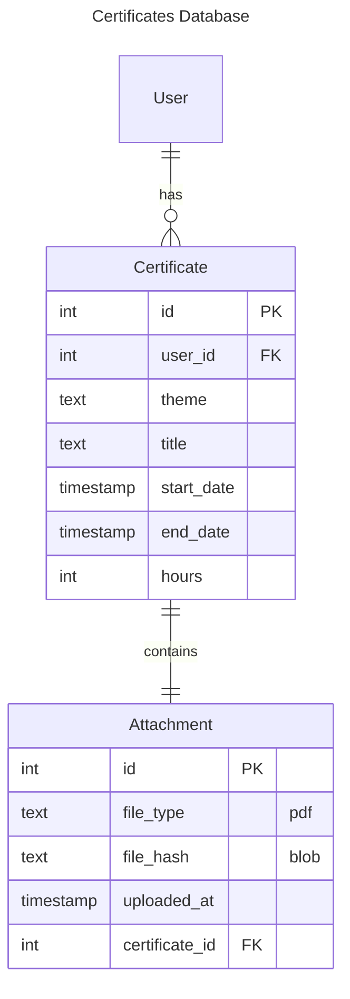

```mermaid
---
title: Certificates Database
---

erDiagram

    Certificate {
        int id PK
        int user_id FK
        text theme
        text title
        timestamp start_date
        timestamp end_date
        int hours
    }

    Attachment {
        int id PK
        text file_type "pdf"
        text file_hash "blob"
        timestamp uploaded_at
        int certificate_id FK
    }

    User ||--o{ Certificate: has
    Certificate ||--|| Attachment: contains

```