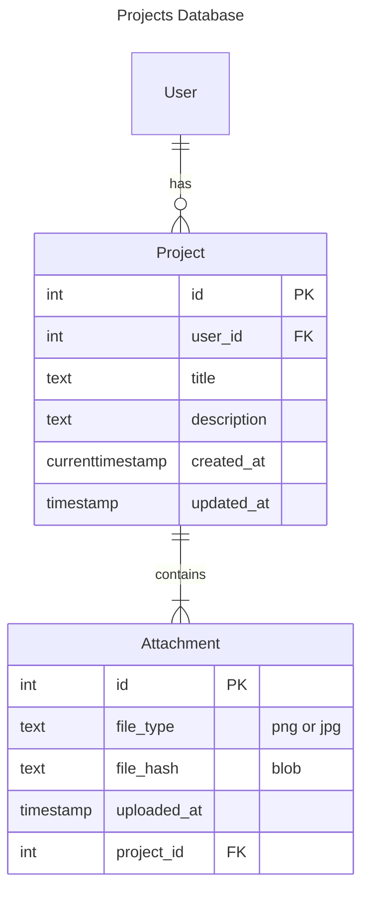

```mermaid
---
title: Projects Database
---
erDiagram

    Project {
        int id PK
        int user_id FK
        text title
        text description
        currenttimestamp created_at
        timestamp updated_at
    }

    Attachment {
        int id PK
        text file_type "png or jpg"
        text file_hash "blob"
        timestamp uploaded_at
        int project_id FK
    }

    User ||--o{ Project : has
    Project ||--|{ Attachment: contains

```